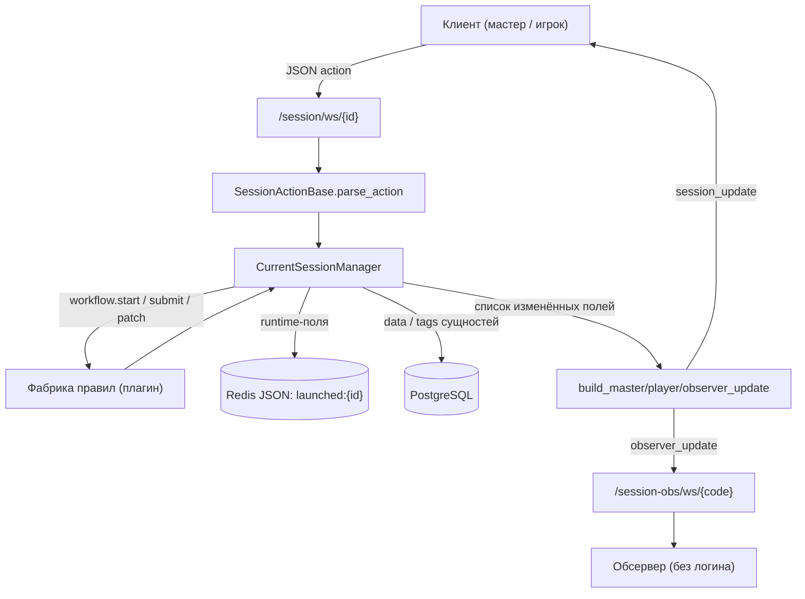
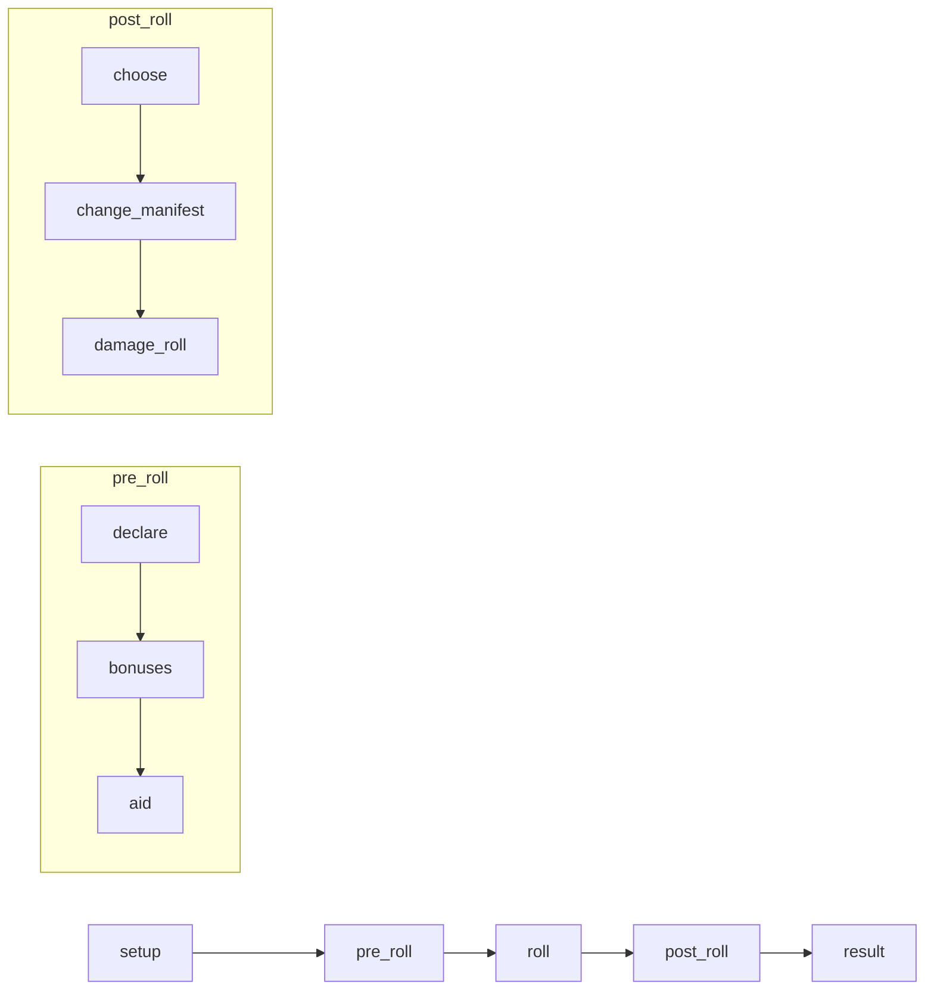
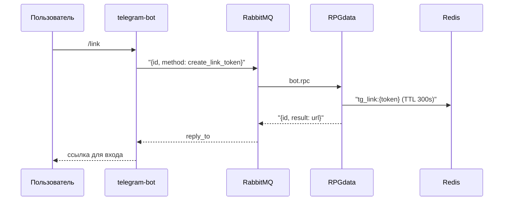

# Архитектура

## Состав системы

| Сервис | Каталог | Стек | Порт (dev) |
|--------|---------|------|-----------|
| API + WebSocket | [RPGdata/](../RPGdata) | FastAPI, SQLAlchemy, Alembic | 6601 |
| Веб-клиент | [RPGWebMainClient/](../RPGWebMainClient) | Next.js (App Router), zustand | 6602 |
| Telegram-бот | [telegram-bot/](../telegram-bot) | aiogram, aio-pika | — |
| PostgreSQL | — | сценарии, пользователи, кампании | 6603 |
| Redis | — | лобби, runtime сессий, launched-миры | 6606 |
| RabbitMQ | — | RPC бот ↔ бэкенд | 6607 / 6608 |

`RPGdata` и `RPGWebMainClient` подключены как git-сабмодули (см. [.gitmodules](../.gitmodules)), поэтому у них своя история коммитов и свои ветки.

## Ключевое архитектурное решение: гибридное хранилище

Это главное, что нужно понять про проект. Состояние сессии живёт **в двух местах одновременно**.

**PostgreSQL** хранит долговременные данные: сценарии и все их сущности, пользователей, кампании, `game_session`, историю бросков, заявки на персонажей.

**Redis** хранит живой рантайм сессии — JSON-документ `SessionRuntimeState`: сцены, логи, действия, уведомления, аудио-очередь, что игроки уже увидели.

Ключ в Redis выбирается в [`_session_key()`](../RPGdata/app/managers/session/data_manager.py) (строка 30):

```python
def _session_key(self) -> str:
    if self.launched_scenario_id:
        return f"{LAUNCHED_KEY_PREFIX}:{self.launched_scenario_id}"
    return f"{SESSION_KEY_PREFIX}:{self.session_id}"
```

Для запущенного мира (`launched`) ключ привязан к **снимку сценария**, а не к сессии. Несколько сессий-«подходов» кампании работают с одним и тем же документом — так между эпизодами сохраняется общий мир. Легаси-путь `session:{id}` используется для сессий без launched-сценария.

Из этого раздвоения растёт целый класс дефектов — см. `BE-01`, `BE-06`, `BE-13` в [04-issues-backend.md](04-issues-backend.md).

## Чтение и запись полей сессии

`get_field` / `set_field` в [data_manager.py](../RPGdata/app/managers/session/data_manager.py) (строки 105–127) ведут себя **по-разному в зависимости от поля**, и это неочевидно:

| Тип поля | Примеры | Чтение | Запись |
|----------|---------|--------|--------|
| Runtime | `scenes`, `logs`, `actions`, `notifications` | Redis JSON path | Redis JSON path |
| Сущности с персистом | `npcs`, `characters`, `items` | Postgres через кеш | Postgres (`data` и `tags`) + сброс кеша |
| Остальные сущности | `locations`, `notes`, `counters`, `story_beats` | Postgres через кеш | **только сброс кеша, запись теряется** |

Последняя строка — источник багов: `set_field("locations", ...)` молча ничего не сохраняет.

`get_inner()` собирает композит `GameSessionInner` = рантайм из Redis + снимок сущностей из Postgres, с кешированием в `_entity_cache`.

## Поток данных сессии



Обработчик возвращает `(ok, fields)` — список изменённых полей. По нему собираются **разные payload-ы для разных ролей**, чтобы игрок не получил скрытые от него данные.

## WebSocket

Три эндпоинта:

| Эндпоинт | Файл | Аутентификация |
|----------|------|----------------|
| `/session/ws/{session_id}` | [session.py](../RPGdata/app/routes/websocket/session.py) | cookie `access_token` |
| `/lobby/ws/{lobby_id}` | [lobby.py](../RPGdata/app/routes/websocket/lobby.py) | cookie `access_token` |
| `/session-obs/ws/{code}` | [observers.py](../RPGdata/app/routes/websocket/observers.py) | **нет** — только знание кода |

Типы сообщений от сервера: `session_init`, `session_update`, `rpc_result`, `session_finished`, `session_not_found`, `session_return_to_lobby`.

Поверх сокета работает **RPC**: клиент добавляет `request_id`, сервер отвечает `rpc_result` — см. [ws_rpc.py](../RPGdata/app/routes/websocket/ws_rpc.py). Используется для `editor_config`, `validate_entity`, `list_replace_characters`.

Ролевые фильтры полей заданы в [managers/session/\_\_init\_\_.py](../RPGdata/app/managers/session/__init__.py): `MASTER_ALWAYS_FIELDS`, `PLAYER_ALWAYS_FIELDS`, `OBSERVER_ALWAYS_FIELDS`.

## Система плагинов правил

Каждая ролевая система — отдельный плагин. Сценарий указывает систему в `Scenario.rule_id_str`, и по нему подбирается фабрика.

**Бэкенд:** `DirPluginRegistry` ([registry_singleton.py](../RPGdata/app/plugins/registry_singleton.py)) сканирует `plugins/**/backend/plugin.py` и вызывает `create_plugin()`. Зарегистрировано 9 плагинов: `pbta_base`, `dungeon_world`, `gumshoe` (+ 3 варианта), `blades_in_the_dark`, `everyone_is_john`, `im_bitter_and_i_keep_records`.

**Фронтенд:** зеркальная структура в `RPGWebMainClient/plugins/**`; `getPluginUI(rule_id_str)` ([uiRegistry.tsx](../RPGWebMainClient/app/plugins/uiRegistry.tsx)) лениво импортирует редакторы, вьюхи и `ActionHandler`. Если экспорта нет — подставляется заглушка из [mock.tsx](../RPGWebMainClient/app/plugins/mock.tsx).

Единая точка входа на бэкенде — `BaseRulesFactory.handle(kind, entity, payload)` с видами `actions.list`, `workflow.start`, `workflow.submit`, `workflow.patch`, плюс CRUD-контракты `schema`, `config`, `options`, `validate`, `init`.

## Конвейер perform_move (Dungeon World)

Самый сложный workflow в проекте. Фазы верхнего уровня хранятся в `workflow.stageKey`, а внутри фазы — под-шаги визарда в `workflow.stageData.wizard`.



Ключевые файлы: [workflow.py](../RPGdata/plugins/pbta/dungeon_world/base/backend/workflows/perform_move/workflow.py), [stage_store.py](../RPGdata/plugins/pbta/dungeon_world/base/backend/workflows/perform_move/stage_store.py), стадии в `stages/`.

Важные детали контракта:

- Выбранные ходы лежат в `context.entry.moves[]` (массив `MoveRef`), **не** в `entry.move`.
- Результаты броска — в `context.entry.roll` (`dice`, `total`, `outcome`, `result_text`).
- `stageData.wizard.steps[]` несёт флаги `disabled`, `readonly`, `frozen`, `editable`, по которым UI решает, что показывать и что можно править.
- Побочные эффекты на мир накапливаются в `stageData.sessionPatch` и применяются в стадиях `apply` / `damage_apply`.

## Аутентификация

Четыре способа входа, все заканчиваются httpOnly-куками `access_token` + `refresh_token`:

| Способ | Эндпоинт |
|--------|----------|
| Email + пароль | `POST /auth/login` |
| Регистрация | `POST /auth/register` |
| Telegram Mini App | `POST /auth/telegram` (валидация `initData`) |
| Magic-link | `POST /auth/link` (одноразовый токен из Redis, TTL 300 с) |

Все защищённые эндпоинты читают токен **только из cookie** ([user.py](../RPGdata/app/auth/user.py)) — Bearer-заголовок не поддерживается.

## Telegram-бот

Бот вынесен в отдельный контейнер и **не имеет доступа к БД**. Вся бизнес-логика на бэкенде, общение — через RabbitMQ RPC (exchange `rpg.rpc`, очередь `backend.bot.rpc`):



Методы RPC: `create_link_token`, `create_lobby`.

## Модель данных

Сценарные сущности (все в `app/models/scenario/`, у всех есть `scenario_id`): `story_beat`, `location`, `npc`, `game_item`, `player_character`, `note`, `counter`, `obstacle`, `scene_exposure`, `scenario_todo`.

Рантайм и мета: `game_session`, `campaign`, `scenario_party`, `player_seen`, `player`, `roll_record`, заявки на персонажей, пакеты сущностей и шаблоны.

**Сцены не хранятся в SQL.** Живые сцены — это `SceneInner` внутри Redis-документа. На этапе подготовки расстановка задаётся через `scene_exposure` на локациях и story beat'ах.

Миграции: 25 ревизий Alembic, единственная голова — `l1m2n3o4p5q6_roll_record`. Redis-схема миграциями не покрыта.

## Жизненный цикл игры

```
Prep-сценарий → Запуск (launched snapshot) → Лобби → Сессия (подход) → Завершение
                        ↑______________________________________|
                              мир сохраняется в Redis
```

При завершении подхода ([`finish_session`](../RPGdata/app/managers/session/__init__.py)) сессия деактивируется в Postgres, снимаются снимки персонажей, выполняется carryover кампании. Redis-ключ `launched:{id}` **не удаляется** — иначе потерялся бы общий мир; он живёт до явного закрытия launched-сценария.
