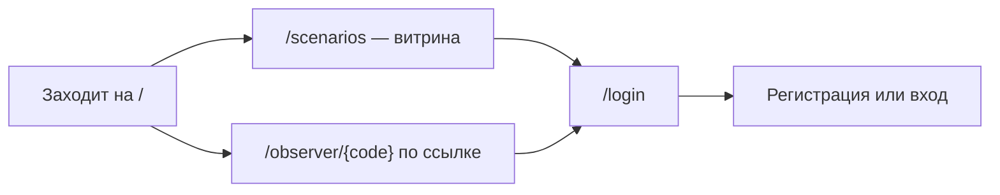
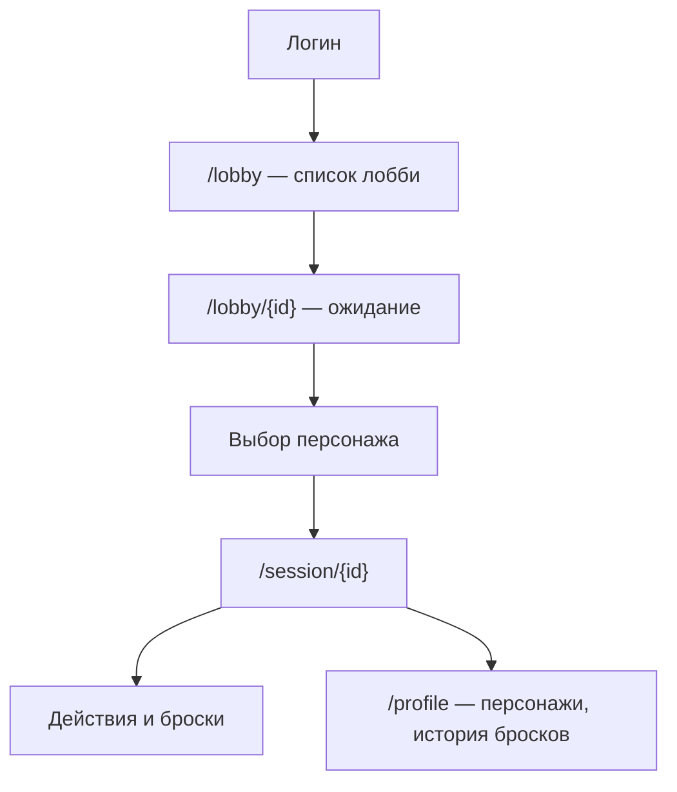
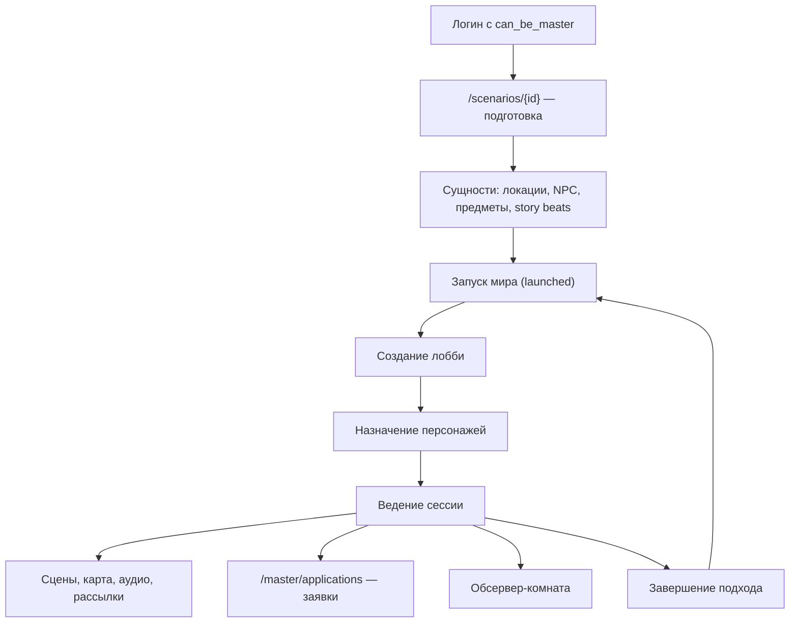
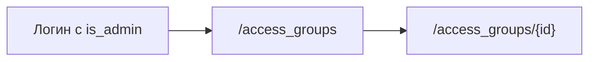

# Пользовательские пути

Как реальный человек проходит через продукт и где он спотыкается. Проблемы здесь описаны с точки зрения пользователя; их технические причины — в [05-issues-frontend.md](05-issues-frontend.md).

## Аноним

Обсервер-режим — самая сильная точка входа: ссылку можно кинуть кому угодно, регистрация не нужна.

**Проблемы пути:**

- **Нет Telegram-входа на `/login`.** Страница [login/page.tsx](../RPGWebMainClient/app/login/page.tsx) содержит только `LoginForm` и `RegisterForm`. Вход через Telegram срабатывает **исключительно автоматически** внутри Mini App ([TelegramInitClient.tsx](../RPGWebMainClient/app/components/layout/TelegramInitClient.tsx)). Пользователь, пришедший в браузер по ссылке от бота, не может выбрать «войти через Telegram» — способ входа существует, но недоступен.
- **Неверный код обсервера** не даёт понятной ошибки: сокет просто не подключается.

## Игрок

**Проблемы пути:**

- **Пустой экран вместо объяснения.** [PlayerView.tsx:42](../RPGWebMainClient/app/components/session/playerView/PlayerView.tsx) — `if (!selfPlayer?.character_id) return null;`. Игрок, которому мастер ещё не назначил персонажа, попадает в сессию и видит **ничего**: ни «ждите назначения», ни кнопки. Выглядит как поломка сайта.
- **Бесконечный спиннер.** [session/\[id\]/page.tsx:31-38](../RPGWebMainClient/app/session/[id]/page.tsx) крутит лоадер, пока `sessionData` пусто. Если `session_init` не пришёл — сокет упал, сессия завершена, нет доступа — спиннер крутится вечно, без таймаута и без сообщения.
- **«У тебя нет роли».** Та же страница, строка 41 — конечное состояние без объяснения и без выхода. Пользователь не понимает, что делать: писать мастеру? обновить страницу? уйти?
- **Список лобби без пустого состояния и без ошибок.** [LobbyList.tsx:35-36](../RPGWebMainClient/app/components/lobby/LobbyList.tsx) — ошибка API уходит только в `console.error`, `lobbies` остаётся пустым массивом. Упавший бэкенд и «лобби пока нет» выглядят для пользователя **одинаково**.
- **Потерянные действия при обрыве связи.** Если WebSocket отвалился, кнопка отправки действия отрабатывает без ошибки, но ничего не происходит — см. `FE-03`. Игрок думает, что нажал, а сервер ничего не получил.
- **Отмена действия.** Инициатор может отменить действие до броска; после броска — нет. Правило само по себе разумное, но кнопка просто исчезает, без подсказки почему.

## Мастер

**Проблемы пути:**

- **Нет guard-а на страницах мастера.** [master/applications/page.tsx](../RPGWebMainClient/app/master/applications/page.tsx) не проверяет ни `can_be_master`, ни авторизацию вообще — страница открывается всем, а данные не приходят. Пользователь видит сломанный экран вместо «нет доступа».
- **Разница подготовки и запуска не объяснена в UI.** Понятия «сценарий», «запущенный мир», «подход» и «кампания» — четыре разных сущности, но интерфейс не подсказывает, где сейчас находится мастер и что произойдёт при запуске. Это единственная концептуально сложная часть продукта, и она не объяснена.
- **Завершение подхода необратимо** и не показывает, что именно перенесётся в следующий (carryover). Мастер жмёт «завершить», не видя последствий.
- **Правки локаций из сессии теряются.** `set_field("locations", ...)` не пишет в Postgres (см. `BE-15`) — изменения живут до перезагрузки кеша и молча пропадают.

## Админ

**Проблемы пути:**

- Guard есть только на списке ([access_groups/page.tsx:30](../RPGWebMainClient/app/access_groups/page.tsx) — `if (!state.user?.is_admin)`), а на карточке `/access_groups/[id]` его нет — см. `FE-05`. Прямая ссылка открывает страницу любому.

## Обсервер

Открывает `/observer/{code}` → сокет `/session-obs/ws/{code}` → видит урезанный набор данных.

**Проблемы пути:**

- Код комнаты — **единственная защита**, эндпоинт не аутентифицирован (`BE-08`). Утёкшая ссылка даёт бессрочный доступ, отозвать её нельзя.
- Нет индикации «мастер ещё не начал» — пустая сцена и техническая ошибка выглядят одинаково.

## Сквозная проблема: обратная связь об ошибках

Она повторяется во всех путях и стоит того, чтобы вынести отдельно. По коду видно устойчивый паттерн: ошибка ловится, пишется в `console.error`, состояние остаётся пустым, **пользователю не показывается ничего**. В результате три разные ситуации — «данных нет», «бэкенд упал», «нет прав» — визуально неразличимы.

Минимальный набор, который закрывает большую часть боли:

1. Пустые состояния с текстом и понятным следующим действием.
2. Видимые сообщения об ошибках вместо тихого `console.error`.
3. Таймаут на ожидание `session_init` с предложением переподключиться.
4. Индикатор состояния WebSocket в сессии — пользователь должен видеть, что связь потеряна.
