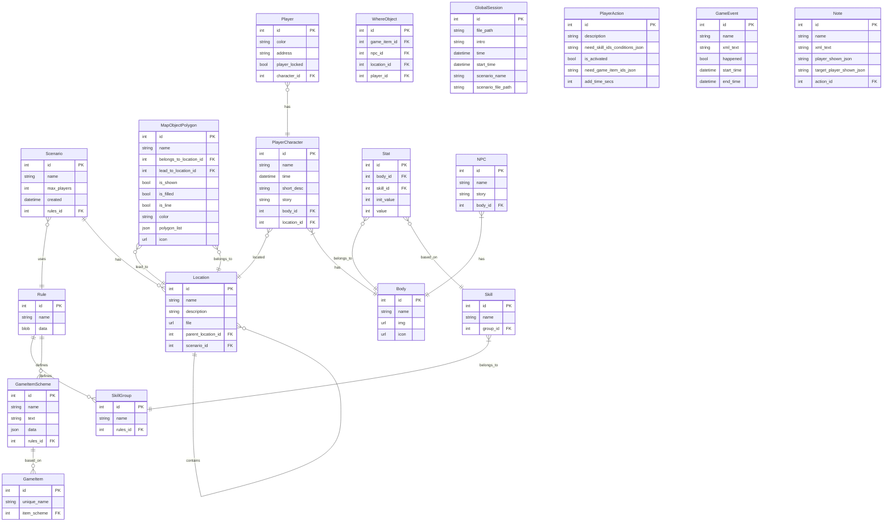

```mermaid
erDiagram
    Scenario {
        int id PK
        string name
        int max_players
        datetime created
        int rules_id FK
    }

    Rule {
        int id PK
        string name
        blob data
    }
    Scenario }o--|| Rule: uses

    SkillGroup {
        int id PK
        string name
        int rules_id FK
    }
    Rule ||--o{ SkillGroup: defines

    Skill {
        int id PK
        string name
        int group_id FK
    }
    Skill }|--|| SkillGroup: belongs_to

    GameItemScheme {
        int id PK
        string name
        string text
        json data
        int rules_id FK
    }
    Rule ||--o{ GameItemScheme: defines

    GameItem {
        int id PK
        string unique_name
        int item_scheme FK
    }
    GameItemScheme ||--o{ GameItem: based_on

    Location {
        int id PK
        string name
        string description
        url file
        int parent_location_id FK
        int scenario_id FK
    }
    Scenario ||--o{ Location: has
    Location ||--o{ Location: contains


    MapObjectPolygon {
        int id PK
        string name
        int belongs_to_location_id FK
        int lead_to_location_id FK
        bool is_shown
        bool is_filled
        bool is_line
        string color
        json polygon_list
        url icon
    }
    MapObjectPolygon }o--|| Location: lead_to
    MapObjectPolygon }o--|| Location: belongs_to

    Player {
        int id PK
        string color
        string address
        bool player_locked
        int character_id FK
    }

    Body {
        int id PK
        string name
        url img
        url icon
    }

    PlayerCharacter {
        int id PK
        string name
        datetime time
        string short_desc
        string story
        int body_id FK
        int location_id FK
    }
    Player }o--|| PlayerCharacter: has
    PlayerCharacter }o--|| Location: located
    PlayerCharacter }|--|| Body: has


    Stat {
        int id PK
        int body_id FK
        int skill_id FK
        int init_value
        int value
    }
    Stat }o--|| Body: belongs_to
    Stat }o--|| Skill: based_on

    NPC {
        int id PK
        string name
        string story
        int body_id FK
    }
    NPC }|--|| Body: has


    WhereObject {
        int id PK
        int game_item_id FK
        int npc_id FK
        int location_id FK
        int player_id FK
    }
    GlobalSession {
        int id PK
        string file_path
        string intro
        datetime time
        datetime start_time
        string scenario_name
        string scenario_file_path
    }
    PlayerAction {
        int id PK
        string description
        string need_skill_ids_conditions_json
        bool is_activated
        string need_game_item_ids_json
        int add_time_secs
    }
    GameEvent {
        int id PK
        string name
        string xml_text
        bool happened
        datetime start_time
        datetime end_time
    }
    Note {
        int id PK
        string name
        string xml_text
        string player_shown_json
        string target_player_shown_json
        int action_id FK
    }
```