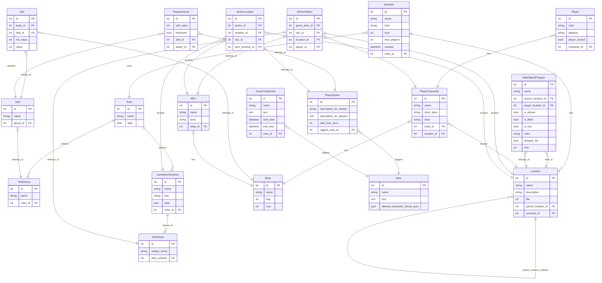

```mermaid
erDiagram
    Scenario {
        int id PK
        string name
        string intro
        url icon
        int max_players
        datetime created
        int rules_id FK
    }

    Rule {
        int id PK
        string name
        blob data
    }
    Scenario }o--|| Rule: uses

    SkillGroup {
        int id PK
        string name
        int rules_id FK
    }
    Rule ||--o{ SkillGroup: defines

    Skill {
        int id PK
        string name
        int group_id FK
    }
    Skill }|--|| SkillGroup: belongs_to

    GameItemScheme {
        int id PK
        string name
        string text
        json data
        int rules_id FK
    }
    Rule ||--o{ GameItemScheme: defines

    GameItem {
        int id PK
        string unique_name
        int item_scheme FK
    }
    GameItemScheme ||--o{ GameItem: based_on

    Location {
        int id PK
        string name
        string description
        url file
        int parent_location_id FK
        int scenario_id FK
    }
    Scenario ||--o{ Location: has
    Location ||--o{ Location: parent_contains_children


    MapObjectPolygon {
        int id PK
        string name
        int source_location_id FK
        int target_location_id FK
        bool is_shown
        bool is_filled
        bool is_line
        string color
        json polygon_list
        url icon
    }
    MapObjectPolygon }o--|| Location: lead_to
    MapObjectPolygon }o--|| Location: belongs_to

    Player {
        int id PK
        string color
        string address
        bool player_locked
        int character_id FK
    }

    Body {
        int id PK
        string name
        url img
        url icon
    }

    PlayerCharacter {
        int id PK
        string name
        string short_desc
        string story
        int body_id FK
        int location_id FK
    }
    Player }o--|| PlayerCharacter: has
    PlayerCharacter }o--|| Location: located
    PlayerCharacter }|--|| Body: has


    Stat {
        int id PK
        int body_id FK
        int skill_id FK
        int init_value
        int value
    }
    Stat }o--|| Body: belongs_to
    Stat }o--|| Skill: based_on

    NPC {
        int id PK
        string name
        string story
        int body_id FK
    }
    NPC }|--|| Body: has


    WhereObject {
        int id PK
        int game_item_id FK
        int npc_id FK
        int location_id FK
        int player_id FK
    }
    WhereObject }|--|| NPC: belongs_to
    WhereObject }|--|| GameItem: belongs_to
    WhereObject }|--|| Location: located
    WhereObject }|--|| PlayerCharacter: belongs_to

    Note {
        int id PK
        string name
        xml text
        json allowed_character_shown_json
    }

    PlayerAction {
        int id PK
        string description_for_master
        xml description_for_players
        int add_time_secs
        int riggers_note_id FK
    }
    PlayerAction }o--|| Note: triggers

    Requirements {
        int id PK
        int skill_value
        bool threshold
        int skill_id FK
        int action_id FK
    }
    Requirements }o--|| Skill: requires
    Requirements }|--|| PlayerAction: belongs_to

    ActionLocated {
        int id PK
        int action_id FK
        int location_id FK
        int npc_id FK
        int item_scheme_id FK
    }
    ActionLocated ||--|| PlayerAction: belongs_to
    ActionLocated }o--|| Location: located
    ActionLocated }o--|| NPC: located
    ActionLocated }o--|| GameItemScheme: located

    GameTimeEvent {
        int id PK
        string name
        xml text
        datetime start_time
        datetime end_time
        int note_id FK
    }
    GameTimeEvent }o--|| Note: triggers

```